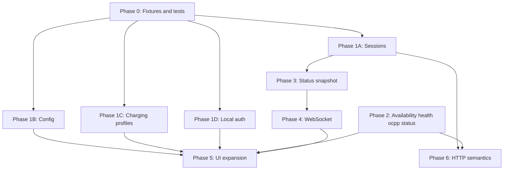

# Plan: Bridge Mission Control ↔ REST API Gaps

Phased work to align **ChargeGhost Mission Control** with the current server contract in [REST_API.md](../REST_API.md). Order: **correctness first**, then **live state fidelity**, then **breadth and polish**.

**Last synced with REST_API.md:** current repo version (includes `GET /api/v1/ocpp/status`, PascalCase charging profiles, local-auth list shapes, expanded WebSocket events).

**Related:** `src/lib/api.ts` (REST client), `src/lib/types.ts` + `src/lib/api-normalizers.ts` (shapes), `src/hooks/useWebSocket.ts` (real-time).

---

## Goals

1. **Contract fidelity** — Requests, responses, and types match `REST_API.md` (intentional deviations documented and tested).
2. **Observable simulator state** — Status, WebSocket events, and UI expose `reservations`, `pending_remote_starts`, uptime, OCPP link health, etc.
3. **Progressive UI exposure** — Every client method is used in UI or listed as deferred in `docs/API_ALIGNMENT.md`.
4. **Actionable errors** — HTTP 201/202/403/409/503 and `StandardResponse.details` map to clear UI copy.

---

## Guiding principles

- **Normalize at the boundary** — Server may use Go/PascalCase (`ProfileID`, `Status`) or mixed local-auth shapes; app view models stay consistent in `types.ts` via `api-normalizers.ts`.
- **Prefer WebSocket deltas** over polling; keep REST fallback when WS is down.
- **Small PRs** — one phase or sub-phase per PR when possible.
- **Contract tests** from `REST_API.md` examples in `src/lib/__tests__/api-contract-fixtures.ts` + `api-client.test.ts`.

---

## Spec highlights (drives this plan)

| Area | REST_API.md expectation |
|------|-------------------------|
| **403** | Read-only OCPP config key **or** offline local authorization rejected |
| **202** | Deferred connector availability (message: scheduled after active session ends) |
| **start-charging** | Optional `timeout_seconds`; uses **`config.rfid_tag`** only (not connector RFID) |
| **sessions/start** | `connector_id`, optional `id_tag`, optional `timeout_seconds`; SoC from `ev_battery_capacity` (kWh) |
| **Config PATCH** | `applied` / `no-op` / `restart_required`; `ev_battery_capacity` + `rfid_tag` apply **immediately** |
| **Local auth list** | GET entries: `authorization_status`, `is_expired`; PUT entries: Go names `IDTag`, `Status`, `Expiry`, … |
| **Charging profiles** | `engine.ChargingProfile` PascalCase (`ProfileID`, `Schedule.Periods`, …) on POST/GET |
| **Firmware/diagnostics** | Go structs with PascalCase fields (`Status`, `Location`, …) |
| **OCPP** | New **`GET /api/v1/ocpp/status`** link-health snapshot; raw start/stop **with JSON bodies** |
| **WebSocket** | `tick` payload **equals** `state_snapshot`; plus `ocpp_*`, queue overflow, 2.0.1 display/cost events |

---

## Phase 0 — Foundation (1 PR, ~0.5 day)

**Outcome:** Safe to change API code without regressions.

| Task | Files |
|------|--------|
| Refresh fixtures from `REST_API.md`: `status`, `sessions/start`, `config` GET/PATCH, `charging-profiles` POST/GET, `composite-schedule`, `firmware/status`, `local-auth-list`, `ocpp/status`, WS `state_snapshot` | `src/lib/__tests__/api-contract-fixtures.ts` |
| Failing tests for known bugs: `max_energy` on `sessions/start`, wrong charging-profile body, wrong local-auth PUT keys | `api-client.test.ts`, `api-normalizers.test.ts` |
| Optional tracker: `docs/API_ALIGNMENT.md` (endpoint → UI status) | `docs/` |

**Exit criteria:** CI fails on current `max_energy` / profile / local-auth payloads until Phase 1 fixes land.

---

## Phase 1 — Contract fixes (High priority, 2–3 PRs)

### 1A — Sessions & charging start

| Gap | Work |
|-----|------|
| `POST /sessions/start` sends `max_energy` | `api.startSession(connectorId, { id_tag?, timeout_seconds? })` only |
| UI “Start Session” | Remove max-energy field; optional timeout + id tag (hint: defaults to `config.rfid_tag`) |
| `POST …/start-charging` | Add `timeout_seconds` query param |
| UX copy | Document that **start-charging ignores connector RFID**; uses `config.rfid_tag` per spec |
| **403** offline auth | Toast when session start / start-charging rejected by local auth list |

**Files:** `src/lib/api.ts`, `src/components/ActionPanel.tsx`, `src/lib/types.ts`, tests.

### 1B — Configuration

| Gap | Work |
|-----|------|
| `ConfigUpdateResponse.action` | `no-op \| applied \| restart_required` (remove legacy `bridge_restart_required` / `runtime_rebuild_required` from types or map in normalizer) |
| `Config` GET fields | `security_profile`, `tls_*`, `connector_type`, `ignored_version` in types + normalizer |
| Settings UI | Security/TLS section; `ocpp_version` select; **kWh** label for `ev_battery_capacity` |
| PATCH UX | Distinguish **immediate** fields (`ev_battery_capacity`, `rfid_tag`) vs **restart_required** list from spec |
| `connectors` in config | Optional read-only display of startup connector definitions |

**Files:** `src/lib/types.ts`, `src/lib/api-normalizers.ts`, `src/components/SettingsPanel.tsx`.

### 1C — Charging profiles

| Gap | Work |
|-----|------|
| POST body | `buildChargingProfilePayload()` → `profile.ProfileID`, `Purpose`, `Schedule.ChargingRateUnit`, `Periods[].StartPeriod` / `Limit` |
| GET list/detail | Normalizer PascalCase → app view model |
| Composite schedule response | Normalize `StartPeriod` / `Limit` in periods |
| UI | Unit selector (W vs A) for `ChargingRateUnit`; handle **409** on install conflict |

**Files:** `api-normalizers.ts` or `charging-profile.ts`, `api.ts`, `SimulatorView.tsx`, tests.

### 1D — Local authorization list

| Gap | Work |
|-----|------|
| GET list entries | Map `authorization_status`, `is_expired` (not `status` only) |
| PUT `updateLocalAuthList` | Send `IDTag`, `Status`, `Expiry`, `ParentIDTag`, `Delete` per spec |
| GET `/{id_tag}` | Normalizer for internal `ocpp.LocalAuthEntry` shape vs list view |
| Settings UI | Show `is_expired`; status enum includes `ConcurrentTx` |

**Files:** `types.ts`, `api-normalizers.ts`, `api.ts`, `SettingsPanel.tsx`, tests.

**Exit criteria:** Create profile → list → composite schedule → delete; sessions/start and local-auth PUT accepted by sidecar; config PATCH shows correct `action`.

---

## Phase 2 — Missing REST surface (1 PR)

| Endpoint | Work |
|----------|------|
| `PUT /connectors/{id}/availability` | `api.setConnectorAvailability(id, type)`; handle **202** + scheduled message |
| `GET /health` | Sidecar liveness on mount (distinct from WS + OCPP) |
| **`GET /api/v1/ocpp/status`** | **New** `api.getOcppStatus()` + types; sidebar or Settings “OCPP link” panel (RTT, reconnect count, 2.0.1 queue fields) |

**Files:** `api.ts`, `types.ts`, `example.tsx`, `SettingsPanel.tsx` or sidebar component.

**Exit criteria:** Availability 202 surfaced; OCPP status visible when bridge configured; 503 envelope handled when bridge not configured.

---

## Phase 3 — Status & snapshot model (1 PR)

| Gap | Work |
|-----|------|
| `StatusSnapshot` | `reservations`, `pending_remote_starts`, `uptime_seconds` |
| `PendingRemoteStart` | `connector_id`, `transaction_id`, `id_tag`, `expiry` |
| UI | Pending remote starts panel; engine uptime in sidebar |
| Reservations | Prefer snapshot when WS connected; keep `GET /reservations` for explicit refresh |

**Files:** `types.ts`, `store/simulator.ts`, `example.tsx`, `SimulatorView.tsx`.

**Exit criteria:** `timeout_seconds` queue visible in UI via `pending_remote_starts` without manual refresh.

---

## Phase 4 — WebSocket event bridge (1–2 PRs)

### 4A — Core simulator events

Handle in `useWebSocket.ts` (patch store or invalidate resources):

| Event | Action |
|-------|--------|
| `state_snapshot`, `tick` | Full replace (unchanged); trust full payload per spec |
| `connector_status_changed` | Patch connector status / plug |
| `connector_plug_changed` | Patch `is_plugged_in` |
| `connector_id_tag_changed` | Patch `id_tag` |
| `connector_params_changed` | Patch electrical params |
| `session_started` / `session_stopped` | Patch `active_sessions` |
| `transaction_id_changed` | Patch `transaction_id` |
| `reservation_changed` | Patch/refetch reservations |
| `connection_state_changed` | Patch `ocpp_connected` |
| `firmware_status_changed` / `diagnostics_status_changed` | Update FW/diag slice |
| `ocpp_config_key_changed` / `ocpp_variable_changed` | Invalidate OCPP keys |
| `charging_profile_changed` | Invalidate profiles |

### 4B — OCPP link & 2.0.1 observability

| Event | Action |
|-------|--------|
| `ocpp_connected` / `ocpp_disconnected` / `ocpp_reconnected` | Toast + patch link state; optional merge into `ocpp/status` view |
| `ocpp_queue_overflow` | Warn toast; show queue depth if OCPP 2.0.1 panel exists |
| `display_message_set` | Optional notification / log strip (2.0.1) |
| `cost_updated` | Optional session cost badge (2.0.1) |

### 4C — UI clarity

- **Local bridge** (WS to `:8080`) vs **OCPP CSMS** (`ocpp_connected` / `GET /ocpp/status`).
- Reduce 3s firmware/diag polling when status events arrive.

**Exit criteria:** Plug/session changes on dashboard without waiting for next `tick`; CSMS disconnect visible without REST poll.

---

## Phase 5 — UI coverage expansion (2–3 PRs)

### 5A — OCPP dev / fault tools

- **`GET /ocpp/status`** detail view (heartbeat RTT, queue metrics).
- Raw helpers with **documented bodies**:
  - `status-notification`, `meter-values`, `data-transfer`
  - `start-transaction` (`connector_id`, `id_tag`, optional `meter_start`, `timestamp`, `reservation_id`)
  - `stop-transaction` (`transaction_id`, `reason`, optional `meter_stop`, `timestamp`)
- Show `details.transaction_id` from start-transaction response.

### 5B — Timeline

- Filters: `direction`, `event_type` (API already supports).
- Expandable `payload`; show `level`, `tags`, `correlation_key`.
- Optional `GET /timeline/count` for header.

### 5C — Sessions & connectors

- `getActiveSession` when snapshot incomplete.
- `stopped_count` from `POST /sessions/stop`.
- Validation hints: voltage 120–1000 V, current 6–150 A, phase 1|3.
- Clarify RFID: connector tag vs `config.rfid_tag` for charging.

### 5D — Local auth & reservations

- List metadata: `version`, `max_entries`, `enabled`.
- Full list replace (`update_type: Full`) with PascalCase entries.
- Dashboard reservation count from snapshot.

### 5E — Firmware, diagnostics, faults

- Firmware/diag forms shared between Simulator and Fault Injection (no hardcoded URLs).
- `chargeghost_failures=N` helper on diagnostics URL.
- Handle **409** when trigger/cancel with no active operation.

---

## Phase 6 — HTTP semantics & errors (0.5–1 PR)

| Code | Spec meaning | Client/UI |
|------|----------------|-----------|
| **201** | Created (connector, reservation) | Success; read `details` for new id |
| **202** | Deferred availability | Info toast with server `message` |
| **403** | Read-only OCPP key **or** local auth rejected | Specific copy per endpoint context |
| **409** | Conflict (session, topology, FW/diag, profile install, raw stop) | Specific copy |
| **503** | OCPP bridge not connected / not configured | Distinguish in OCPP panels |

Add `readDetails<T>()` helper for `StandardResponse.details`.

---

## Dependency graph

**Critical path:** P0 → P1 (A–D) → P3 → P4 → P5.

---

## Suggested PR breakdown

| PR | Title | Phases |
|----|--------|--------|
| 1 | `test: REST contract fixtures (current REST_API.md)` | 0 |
| 2 | `fix: sessions/start and start-charging` | 1A, 6 (partial) |
| 3 | `fix: config types, TLS, restart_required vs immediate` | 1B |
| 4 | `fix: charging profile PascalCase mapping` | 1C |
| 5 | `fix: local auth list shapes and PUT payload` | 1D |
| 6 | `feat: connector availability, health, GET /ocpp/status` | 2 |
| 7 | `feat: status snapshot pending starts and uptime` | 3 |
| 8 | `feat: WebSocket granular + OCPP link events` | 4 |
| 9 | `feat: OCPP raw tools, timeline, shared FW/diag forms` | 5A–5E |
| 10 | `feat: HTTP status and details handling` | 6 |

---

## Testing strategy

| Layer | Approach |
|-------|----------|
| Unit | Normalizers for PascalCase FW/diag/profiles; local-auth PUT/GET; `ocpp/status` |
| Integration | `bun run tauri dev` + sidecar on `:8080` |
| WebSocket | Verify plug/start/reserve/FW without 2s REST poll when WS up |
| Manual smoke | See checklist below |

### Manual smoke script

1. `GET /health` → WS connect → dashboard from `state_snapshot`.
2. Create connector → plug → `start-charging` → stop (note `config.rfid_tag` behavior).
3. `POST /sessions/start` with `timeout_seconds` while unplugged → `pending_remote_starts` in UI.
4. `PUT …/availability` Inoperative → **202** when session active.
5. Charging profile POST (PascalCase) → list → composite schedule.
6. Local auth: differential add with `IDTag`/`Status` → list shows `authorization_status`.
7. `PATCH` config TLS field → `restart_required`; patch `ev_battery_capacity` → immediate SoC effect.
8. `GET /ocpp/status` when connected; raw start/stop with bodies.
9. Offline tag → **403** on session start.

---

## Out of scope

- Unsupported OCPP 2.0.1 operations in REST “Capability Notes” (no REST surface).
- Inbound CSMS `GetCompositeSchedule` (rejected server-side; use REST composite endpoint only).
- Changes to `chargeghost-core` — **Mission Control only**.
- Full Fault Injection redesign (wire real actions + shared forms only).

---

## Effort estimate

| Phase | Effort |
|-------|--------|
| 0 | 0.5 d |
| 1 (A–D) | 3–4 d |
| 2 | 1 d |
| 3 | 1 d |
| 4 | 2–2.5 d |
| 5 | 2–3 d |
| 6 | 0.5 d |
| **Total** | **~10–12 days** |

---

## Success metrics

- No request bodies or field names contradicting `REST_API.md`.
- `GET /api/v1/ocpp/status` exposed in UI; not only `ocpp_connected` from snapshot.
- Local auth PUT uses Go entry names; list shows `authorization_status` / `is_expired`.
- Charging profiles round-trip in `engine.ChargingProfile` shape.
- WebSocket handles link events + core deltas; `tick` not required for plug/session UX.
- `pending_remote_starts` and uptime visible when present.

---

## Reference: gaps vs current REST_API.md (audit snapshot)

### REST client missing or wrong

| Status | Item |
|--------|------|
| **Missing** | `PUT /connectors/{id}/availability` |
| **Missing** | `GET /api/v1/ocpp/status` |
| **Wrong body** | `POST /sessions/start` still sends `max_energy` |
| **Missing param** | `POST …/start-charging?timeout_seconds` |
| **Wrong body** | `PUT /local-auth-list` uses `id_tag`/`status` instead of `IDTag`/`Status`/… |
| **Wrong types** | Local auth list `status` vs `authorization_status` |
| **Shape risk** | Charging profiles (expect `ProfileID`, `Schedule.Periods`, …) |
| **Incomplete** | `ocppRawStartTransaction` / `ocppRawStopTransaction` — no request bodies in client |
| **Type drift** | `ConfigUpdateResponse.action`; `Config.security_profile` + TLS paths; `StatusSnapshot` incomplete |
| **Partial** | Firmware/diagnostics normalizers (PascalCase) — verify against spec examples |

### WebSocket (client)

Handled: `state_snapshot`, `tick` only.

**Not handled (per REST_API.md):**  
`connector_*`, `session_*`, `transaction_id_changed`, `reservation_changed`, `connection_state_changed`,  
`ocpp_connected`, `ocpp_disconnected`, `ocpp_reconnected`, `ocpp_queue_overflow`,  
`display_message_set`, `cost_updated`,  
`ocpp_config_key_changed`, `ocpp_variable_changed`,  
`charging_profile_changed`, `firmware_status_changed`, `diagnostics_status_changed`.

### UI not exposing wrapped APIs

`GET /health`, `GET /ocpp/status`, connector list/get by id, session active/info/by-id, timeline count, local-auth GET by tag, charging profile GET by id, OCPP raw endpoints (tests only), availability API.

### Behavioral notes for implementers

- **Do not** assume connector `id_tag` is used for `start-charging` — use `config.rfid_tag`.
- **`GET /sessions`** returns **active** sessions only (same as `/sessions/info`).
- **Config** documents explicit restart vs immediate fields — reflect in Settings save messaging.
- **Firmware trigger** may return **409** if update already in progress.

---

## Implementation start

**Recommended:** PR 1 (fixtures) → PR 2 (sessions) + PR 5 (local auth) in parallel after fixtures — highest correctness impact for daily simulator use.
